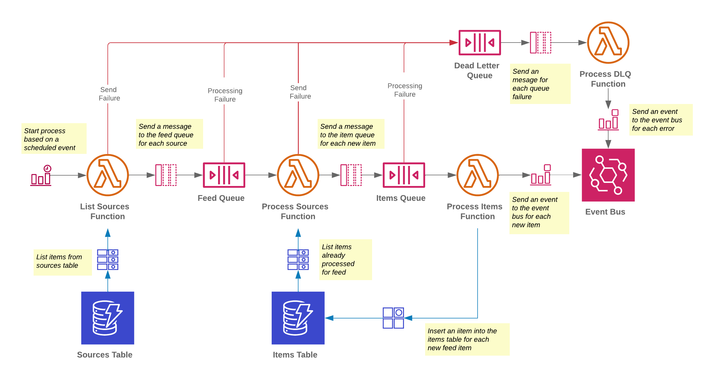

# web-feed-aws-events

> The [RSS Events](https://github.com/craigbailey-dev/rss-events) project has been deprecated in favor of this one. It is still available in the AWS Serverless Application Repository, but will no longer receive any updates.

A highly configurable serverless solution that behaves like a news aggregator for RSS and ATOM feeds, wherein multiple sources are read at given internval, and events for newly discovered items in the feed are sent to an EventBridge event bus. 
 
## Architecture

- **Sources Table** - DynamoDB table that holds all sources of feeds
- **Items Table** - DynamoDB table that record all feed items for which events have been sent
- **Feed Queue** - SQS queue that dispatches a message for each feed
- **Items Queue** - SQS queue that dispatches a message for each new feed item in a feed
- **Dead Letter Queue** - SQS queue that captures any failed SQS messages
- **List Sources Function** - Lambda function that lists all sources of feeds for processing
- **Process Sources Function** - Lambda function that checks the feed for new content
- **Process Items Function** - Lambda function that sends an event to the event bus for each new feed item
- **Process DQL Function** - Lambda function that receives messages from the dead-letter queue and sends an event to the event bus describing the error
- **Event Bus** - EventBridge event bus that receives events for every new feed item and queue message failure

## Table Schema

### Sources Table

| Attribute           | Type                | Description                                                                                    |
| ------------------- |:--------------------| :----------------------------------------------------------------------------------------------|
| source              | String              | An HTTP/S URL for the feed                                                                     |
| type                | String              | The feed type (ATOM or RSS)                                                                    |
| httpHeaderOverrides | Map<String, String> | A map of HTTP headers to set when making a request to retrieve content from the source      |

### Items Table

| Attribute      | Type                | Description                                                                                    |
| ---------------|:--------------------| :----------------------------------------------------------------------------------------------|
| source         | String              | The URL of the feed                                                                            |
| id 		     | String              | The unique ID of the channel item                                                              |

## Events

There are multiple event types that can be sent to the event bus. 

| Event                    |Description                               | Schema                                                
| -------------------------|:-----------------------------------------|:----------------------------------------------------------------------------------------------------------------
| New Feed Item            | A new item has been added to the feed    | [JSON Schema](docs/schema/new-item.schema.json)&nbsp;&nbsp;[Markdown](docs/schema/new-item.schema.md)
| Queue Send Failure 	   | Failed to send a message to a queue      | [JSON Schema](docs/schema/queue-send-failure.event)&nbsp;&nbsp;[Markdown](docs/schema/new-item.schema.md)
| Queue Processing Failure | Failed to process a message from a queue | [JSON Schema](docs/schema/queue-processing-failure.json)&nbsp;&nbsp;[Markdown](docs/schema/new-item.schema.md)